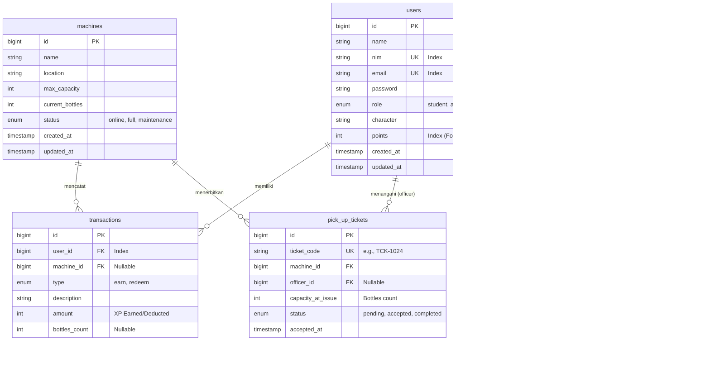

### 1. Analisis Pola Akses (Access Patterns) & Beban

Dari UI yang ada, kita memiliki pola akses database berikut:

*   **Read-Heavy (Tinggi):** Papan peringkat (Leaderboard), status mesin saat ini, dan katalog hadiah. (Ini sering dibuka oleh banyak mahasiswa secara bersamaan).
*   **Write-Heavy (Sedang):** Log transaksi/riwayat penyetoran botol dari mesin IoT dan sistem ticketing petugas.
*   **Transaksional (Kritis):** Penukaran poin (XP) dengan hadiah. Harus mencegah race condition (mahasiswa menekan tombol tukar berkali-kali secara bersamaan).

### 2. Entity-Relationship Diagram (ERD) Lengkap

Salin blok Mermaid di bawah ini ke Markdown viewer atau Notion Anda untuk melihat relasi visualnya:



### 3. Strategi Skema & Indexing (Laravel Migration)

Untuk menjaga performa di cPanel, kita harus menaruh Index pada kolom yang sering dicari (WHERE) atau diurutkan (ORDER BY).

**A. Tabel users**

*   Struktur: Menyimpan data kredensial dan total XP.
*   Strategi Indexing: Tambahkan `$table->index('points')`. Di halaman Dashboard, Anda menampilkan Leaderboard. Mengurutkan jutaan baris tanpa indeks pada kolom points akan membuat server cPanel crash. Dengan indeks, query `User::orderBy('points', 'desc')->limit(10)` akan dieksekusi dalam hitungan milidetik.

**B. Tabel transactions (Global Log)**

*   Struktur: Semua mutasi (masuk/keluar) XP dan penyetoran botol disimpan di sini. Ini mematuhi prinsip Event Sourcing dasar.
*   Strategi Indexing: Buat Composite Index pada `$table->index(['user_id', 'created_at'])`. Saat mahasiswa membuka tab LOG, Laravel akan mencari `WHERE user_id = ? ORDER BY created_at DESC`. Indeks gabungan ini akan mempercepat proses tersebut.

**C. Tabel reward_redemptions**

*   Struktur: Memisahkan data transaksi "barang" dari tabel log mutasi.
*   Denormalisasi Kritis: Kolom `cost_at_redemption` sangat penting. Jika besok harga "Voucher Kantin" naik dari 1500 XP menjadi 2000 XP, riwayat penukaran mahasiswa di masa lalu tidak boleh ikut berubah. Harga saat tombol ditekan harus disimpan secara statis/mati di kolom ini.

### 4. Pencegahan Bug & Konsistensi Data (Transaction Design)

Dalam Laravel, aksi penukaran poin (Tukar Reward) dan penambahan botol (IoT) adalah jalur kritis yang rentan terhadap Race Condition.

Gunakan Pessimistic Locking (`lockForUpdate`) dipadu dengan `DB::transaction()` pada Controller Laravel Anda nantinya:

```php
// Contoh arsitektur logika di Controller Laravel
DB::transaction(function () use ($user, $reward) {
    // 1. Kunci baris user ini agar tidak bisa dimodifikasi request lain secara bersamaan
    $lockedUser = User::where('id', $user->id)->lockForUpdate()->first();
    
    // 2. Validasi ulang
    if ($lockedUser->points < $reward->cost) {
        throw new Exception("XP tidak cukup");
    }
    
    // 3. Potong XP
    $lockedUser->decrement('points', $reward->cost);
    
    // 4. Catat Riwayat
    RewardRedemption::create([...]);
    Transaction::create(['type' => 'redeem', 'amount' => -$reward->cost]);
});
```

Arsitektur di atas mencegah mahasiswa melakukan eksploitasi (menekan tombol klaim 5x dalam 1 detik dengan script agar mendapat 5 hadiah hanya dengan modal poin 1 hadiah).

### 5. Strategi Caching (Optimalisasi cPanel)

Hosting murah (cPanel) biasanya memiliki batas proses I/O database. Untuk mengatasi ini:

1.  **Cache Statistik Kampus:** Data total botol, CO2, dan Filamen tidak perlu dihitung ulang dari database setiap detik (dengan `SUM()`). Gunakan `Cache::remember('campus_stats', 3600, ...)` di Laravel untuk menyimpannya di file/Redis selama 1 jam. Setiap ada yang membuang botol, cukup increment cache tersebut.
2.  **Cache Leaderboard:** Leaderboard cukup diperbarui setiap 5 atau 10 menit menggunakan fitur Cache Laravel, mengingat peringkat tidak harus real-time hingga hitungan detik.
